  

<table width="100%">
  <tr>
    <td width="64%" valign="middle">
      <h2>About Me / 自己紹介</h2>
      
<i>Based in Tokyo, working as a Systems Engineer.</i>

      
<i>東京でシステムエンジニアしてます。</i>

      
<i>My team is mostly Japanese-speaking, so feel free to reach out in English or Japanese.</i>

      
<i>英語と日本語どっちもいけるので、ぜひ気軽に声をかけてください。</i>

      

        
        
        
      

    </td>
    <td width="36%" align="right" valign="middle">
      
    </td>
  </tr>
</table>

  

<table width="100%">
  <tr>
    <td width="33%" valign="top">
      <h3>What I Build / つくってるもの</h3>
      
<i>I work on backend systems, cloud infrastructure, and practical AI/ML workflows.</i>

      
<i>バックエンド、クラウド基盤、実務で活かせるAI/MLまわりに取り組んでいます。</i>

      
    </td>
    <td width="67%" align="center">
      
    </td>
  </tr>
</table>

<table width="100%">
  <tr>
    <td width="67%" align="center">
      
    </td>
    <td width="33%" valign="top">
      <h3>Focus / 注力分野</h3>
      
<i>Right now, I’m especially focused on reliability, maintainability, and developer productivity.</i>

      
<i>最近は、信頼性や保守性、開発効率の向上に特に注力しています。</i>

      
    </td>
  </tr>
</table>

  

<table width="100%">
  <tr>
    <td width="33%" valign="top">
      <h3>Tech Stack / 技術スタック</h3>
      
<i>Work: C#, .NET, Docker, AWS, Python, AI/ML</i>

      
<i>仕事では C# / .NET / Docker / AWS / Python、あとAI/MLまわりも触ってます。</i>

      

        
        
        
        
        
        
      

      
<i>Personal: Python, C++, Linux</i>

      
<i>個人では Python と C++、Linux環境でいろいろ作ってます。</i>

      
    </td>
    <td width="67%" align="center">
      
    </td>
  </tr>
</table>

<table width="100%">
  <tr>
    <td width="67%" align="center">
      
    </td>
    <td width="33%" valign="top">
      <h3>Off hours / 趣味</h3>
      
<i>If I’m not indoors programming, reading, or watching anime, I like spending my free time exercising and trying new things.</i>

<i>家でコードを書いたり、読書やアニメを楽しんだりしていない時は、運動したり新しいことを試したりして過ごしています。</i>

      
        
      
    </td>
  </tr>
</table>

  

